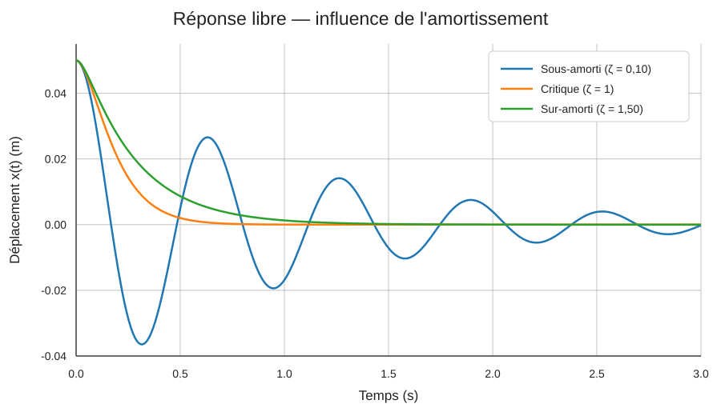

# Réponse libre et identification de l'amortissement

On considère l'oscillateur linéaire à un degré de liberté :

    m x¨(t) + c x˙(t) + k x(t) = 0

avec :

    ωn = √(k/m)
    ccrit = 2√(km)
    ζ = c/ccrit

## 1. Régime sous-amorti

Pour 0 ≤ ζ < 1 :

    ωd = ωn√(1-ζ²)

et

    x(t) = exp(-ζωn t) [A cos(ωd t) + B sin(ωd t)]

La réponse oscille à la pulsation amortie ωd tandis que son enveloppe décroît exponentiellement.

## 2. Amortissement critique

Pour ζ = 1 :

    x(t) = (A + Bt) exp(-ωn t)

C'est la limite entre comportement oscillatoire et apériodique.

## 3. Régime sur-amorti

Pour ζ > 1, l'équation caractéristique possède deux racines réelles négatives. La réponse est une somme de deux exponentielles décroissantes.

## 4. Décrément logarithmique

Dans le régime sous-amorti, si Ai et Ai+1 désignent deux maxima successifs de même signe :

    δ = ln(Ai/Ai+1)

et

    δ = 2πζ / √(1-ζ²)

On peut donc identifier le taux d'amortissement :

    ζ = δ / √(4π² + δ²)

Cette méthode relie directement une mesure temporelle de décroissance à un paramètre du modèle dynamique.

## 5. Exemple numérique — influence de l'amortissement

Le script `examples/comparaison_amortissement.py` considère un oscillateur avec :

- `m = 1 kg` ;
- `k = 100 N/m` ;
- `x(0) = 0,05 m` ;
- `ẋ(0) = 0 m/s`.

On obtient `ωn = √(k/m) = 10 rad/s` et un amortissement critique `ccrit = 20 N·s/m`. Trois valeurs sont comparées : `ζ = 0,10`, `ζ = 1` et `ζ = 1,50`.

### Lecture physique du graphique

**Sous-amorti (ζ = 0,10).** La réponse reste oscillatoire. L'énergie mécanique est dissipée progressivement par l'amortisseur : l'amplitude diminue avec l'enveloppe exponentielle `exp(-ζωn t)`. La pulsation observée est `ωd = ωn√(1-ζ²)`, légèrement inférieure à la pulsation propre non amortie.

**Amortissement critique (ζ = 1).** La réponse ne présente plus d'oscillation. Ce régime constitue la frontière entre réponse oscillatoire et réponse apériodique ; pour les conditions initiales de cet exemple, le retour vers l'équilibre est rapide sans dépassements successifs.

**Sur-amorti (ζ = 1,50).** La réponse est également apériodique, mais le retour vers l'équilibre devient plus lent que dans le cas critique. Augmenter fortement l'amortissement ne signifie donc pas nécessairement revenir plus rapidement à l'équilibre.

Cet exemple permet de visualiser directement le rôle de `ζ` : il modifie à la fois la nature du mouvement et la vitesse de décroissance de la réponse.
